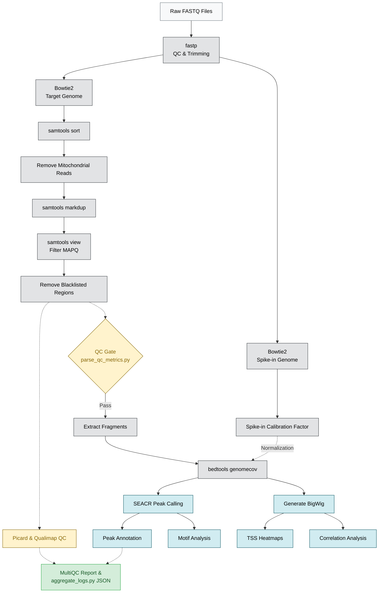

# BDB-Genomics CUT&RUN Pipeline

This repository hosts a robust, highly automated Snakemake pipeline designed for CUT&RUN (Cleavage Under Targets and Release Using Nuclease) sequencing data. It provides end-to-end processing—from raw FASTQ quality control and Bowtie2 alignment, to stringent deduplication, Spike-in calibration, SEACR peak calling, and final motif/heatmap generation. The pipeline is fully containerized, strictly typed, and fortified with automated quality control gating to ensure high reproducibility and fail-safe execution.

---

## 🏗️ Pipeline Architecture

