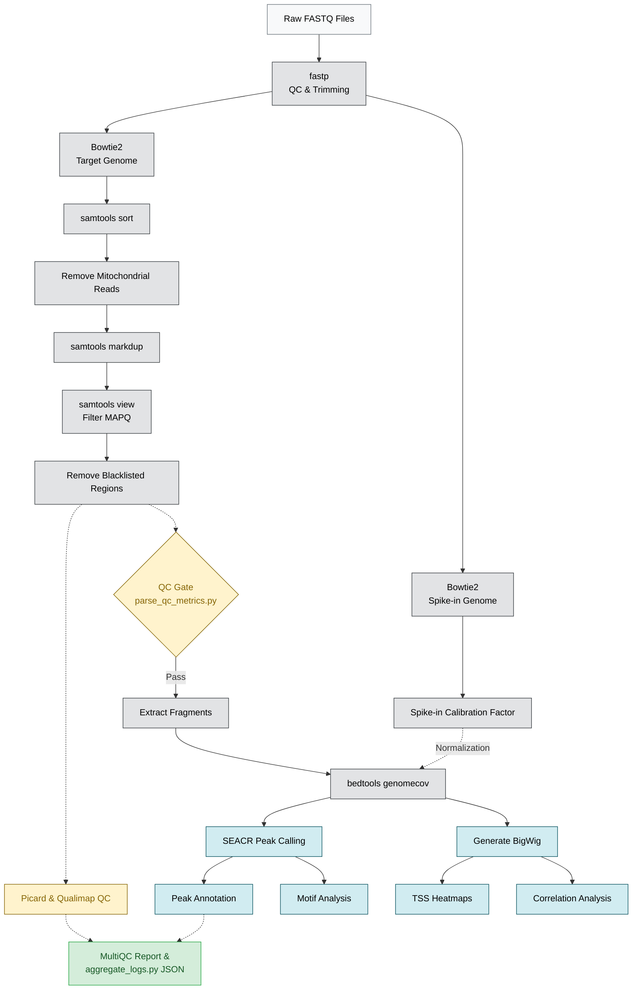

# BDB-Genomics CUT&RUN Pipeline

This repository hosts a robust, highly automated Snakemake pipeline designed for CUT&RUN (Cleavage Under Targets and Release Using Nuclease) sequencing data. It provides end-to-end processing—from raw FASTQ quality control and Bowtie2 alignment, to stringent deduplication, Spike-in calibration, SEACR peak calling, and final motif/heatmap generation. The pipeline is fully containerized, strictly typed, and fortified with automated quality control gating to ensure high reproducibility and fail-safe execution.

---

## 🏗️ Pipeline Architecture



---

## 🚀 Production-Ready Features

This pipeline has undergone a rigorous architecture and security audit, resulting in a hardened, fail-safe production-grade system.

### 1. Pre-Flight Configuration Validation
Before DAG execution, `rules/scripts/validate_config.py` enforces strict schema checks on `config.yaml`. It verifies that all referenced configurations exist, scalar values meet strict type boundaries (e.g., positive floats/integers), and required physical references (genomes, indices, blacklists) are present on disk.

### 2. Low-Resource Batch Orchestration
For environments with severe memory constraints (e.g., laptops with ≤4GB RAM), the `run_batched.py` orchestrator parses the sample sheet, strictly sanitizes sample names against directory traversal vulnerabilities, and sequentially orchestrates Snakemake execution in manageable cohorts to prevent Out-Of-Memory (OOM) failures.

### 3. Graceful Error Degradation
Analytic downstream scripts (`tss_enrichment.R`, `diff_binding.R`, `peak_annotation.R`) are built with fail-safe logic. In the event of catastrophic data quality (e.g., zero peaks called, insufficient library depth), the pipeline avoids unhandled crashes. Instead, it generates empty/dummy matrices and placeholder plots, logs the failure, and allows the remaining cohort to complete successfully.

### 4. Bulletproof Execution
* **Safe Shell Pipes:** All `shell:` directives utilize `set -euo pipefail` to ensure silent upstream piping errors immediately halt execution.
* **Type & Syntax Safety:** Prevents boolean coercion errors in file path generation by explicitly blocking `True`/`False`/`None` configuration bugs.
* **Command Injection Prevention:** Python subprocesses use sanitized arrays (`shell=False`) instead of vulnerable shell string interpolations.
* **Containerized Workflows:** Every bioinformatics tool relies on strictly pinned Conda environments (`envs/*.yaml`) and immutable BioContainer Singularity images, guaranteeing bit-for-bit reproducibility across machines.

---

## ⚙️ Quick Start

```bash
# 1. Edit configuration
vim config.yaml

# 2. Add your samples (Ensure fastq_r1 and fastq_r2 columns exist)
vim data/samples.tsv

# 3. Run the pipeline orchestrator (batches samples automatically)
python3 rules/scripts/run_batched.py --batch-size 4 --cores 8 --memory 16000
```
