<p align="center">
  
</p>

# BDB-Genomics CUT&RUN Pipeline

<p align="center">
  <a href="https://github.com/BDB-Genomics/cutandrun-pipeline/actions"></a>
  <a href="https://snakemake.readthedocs.io"></a>
</p>

<p align="center">
  
</p>

> A robust, automated, and highly modular Snakemake pipeline for the analysis of CUT&RUN (Cleavage Under Targets and Release Using Nuclease) sequencing data. This pipeline handles everything from raw FASTQ files to peak annotation and motif analysis, with a core focus on spike-in normalization and reproducible results.

**Author:** Himanshu Bhandary  
**Contact:** 2032ushimanshu@gmail.com

---

## 📁 Directory Structure

```text
├── Snakefile               # Main workflow entry point
├── config.yaml            # Pipeline parameters and global paths
├── data/
│   ├── samples.tsv        # Sample metadata and FASTQ paths
│   └── reference/         # Genome indices, blacklists, and GTFs
├── rules/                 # Individual Snakemake rule modules
│   ├── envs/              # Conda environment definitions
│   └── scripts/           # Custom validation and analysis scripts
├── profiles/              # Execution profiles (local, slurm)
├── results/               # Final processed data and analysis
└── logs/                  # Detailed execution logs for debugging
```

---

## ⚙️ Configuration

### 1. Sample Sheet (`data/samples.tsv`)
Define your samples in a tab-separated format:
| sample | fastq_r1 | fastq_r2 | replicate | condition |
| :--- | :--- | :--- | :--- | :--- |
| WT_R1 | path/to/R1.fq.gz | path/to/R2.fq.gz | 1 | WT |

### 2. Global Parameters (`config.yaml`)
Update `config.yaml` to point to your reference genomes (Target and Spike-in), blacklist regions, and tool-specific parameters.

---

## 💻 Usage

### Prerequisites
- [Snakemake](https://snakemake.readthedocs.io/)
- [Conda](https://docs.conda.io/) or [Mamba](https://mamba.readthedocs.io/)
- [Singularity](https://sylabs.io/guides/3.0/user-guide/index.html) (optional, for containerized runs)

### Execution

**Validate configuration:**
The pipeline automatically validates your config and sample sheet before starting.

**Run locally:**
```bash
snakemake --profile profiles/local
```

**Run on SLURM cluster:**
```bash
snakemake --profile profiles/slurm
```

---

## 📊 Outputs

- **`results/bigwig/`**: Normalized coverage tracks for visualization in IGV.
- **`results/seacr/`**: Identified peaks (stringent/relaxed).
- **`results/peak_annotation/`**: Feature distribution and genomic annotations.
- **`results/multiqc/`**: Comprehensive HTML report summarizing the entire run.

---

## 📄 License
This project is intended for research purposes. Please contact the author for specific licensing inquiries.
