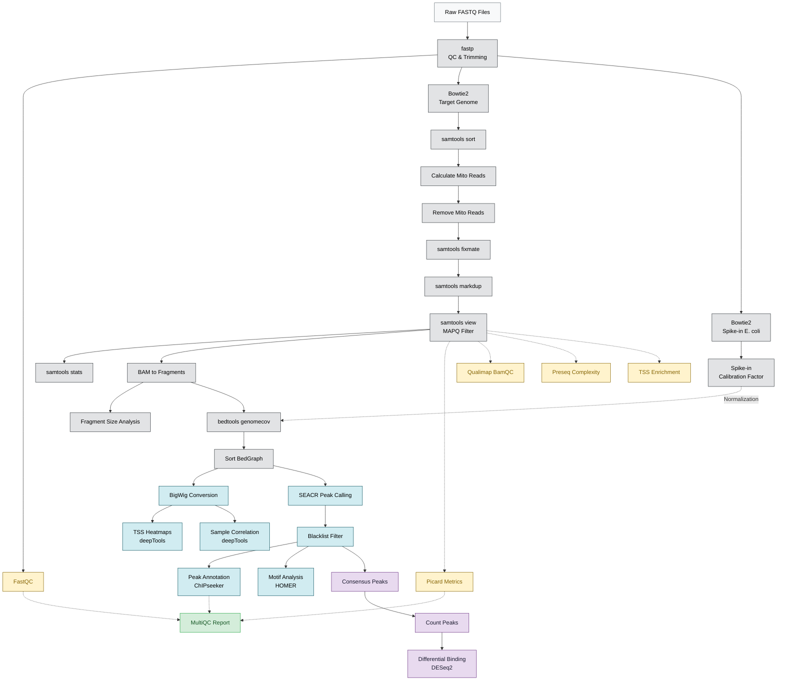

# BDB-Genomics CUT&RUN Pipeline

A production-grade Snakemake pipeline for CUT&RUN sequencing data. Handles the full lifecycle from raw FASTQ reads through alignment, spike-in calibration, peak calling, differential binding analysis, and final reporting.

---

## 🏗️ Pipeline Architecture



---

## ⚙️ Quick Start

```bash
# 1. Configure paths, resources, and parameters
vim config.yaml

# 2. Populate sample sheet (columns: sample, replicate, condition, fastq_r1, fastq_r2)
vim data/samples.tsv

# 3. Standard execution
snakemake --cores 8 --use-conda

# 4. Low-resource batch mode (≤4GB RAM machines)
python3 rules/scripts/run_batched.py --batch-size 2 --cores 4 --memory 4000
```

---

## 🔒 Security & Robustness

| Layer | Mechanism |
|---|---|
| **Pre-flight validation** | `validate_config.py` checks all config keys, scalar types, and physical file paths before DAG construction |
| **Sample sanitization** | Regex rejects shell metacharacters and `..` path traversal in sample names |
| **Shell safety** | Every rule uses `set -euo pipefail`; Python subprocesses use `shell=False` |
| **Graceful degradation** | R/Python analytics write placeholder outputs on zero-data scenarios instead of crashing |
| **Type safety** | Config path extractor rejects boolean/None coercion into file paths |
| **Reproducibility** | Pinned Conda environments + Singularity container directives on every rule |
