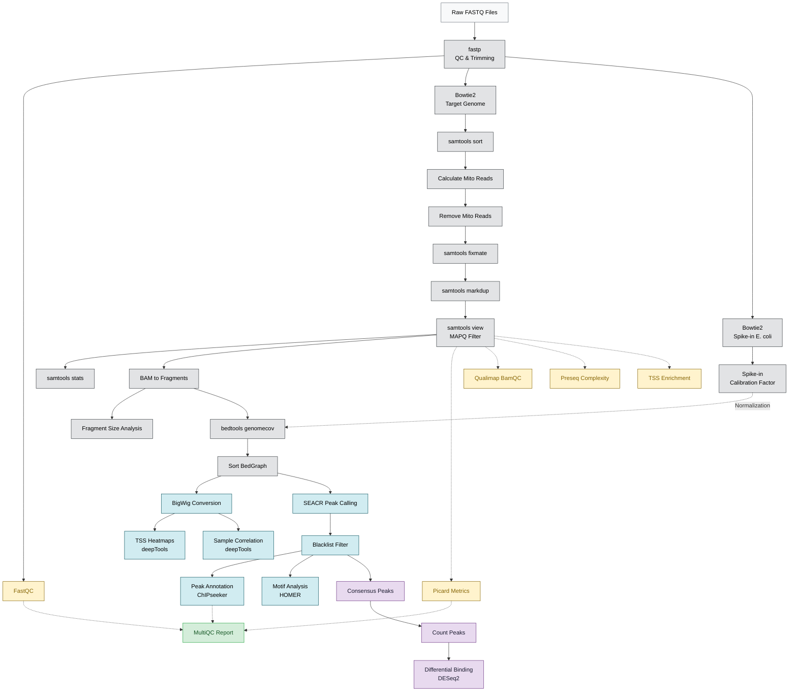

# BDB-Genomics CUT&RUN Pipeline

A production-grade Snakemake pipeline for CUT&RUN sequencing data. Handles the full lifecycle from raw FASTQ reads through alignment, spike-in calibration, peak calling, differential binding analysis, and final reporting.

---

## 🏗️ Pipeline Architecture



---

## ⚙️ Setup & Installation

Follow these steps to set up your environment, reference data, and metadata sheets.

### 1. Prerequisites & Environment Setup
The pipeline relies on **Snakemake 8.0+** and manages dependencies dynamically via Conda/Mamba environments. 

Install the base environment using Conda/Mamba:
```bash
# Create the environment with snakemake and yaml parser
mamba create -n snakemake -c conda-forge -c bioconda snakemake python=3.10 pyyaml

# Activate the environment
conda activate snakemake
```

### 2. Reference Data Preparation
All reference files must be placed inside the `data/reference/` directory (or configured explicitly in `config.yaml`). 

Your target and spike-in Bowtie2 indices must be built beforehand:
```bash
# Example command to build target Bowtie2 index
bowtie2-build genome.fa data/reference/bowtie2/genome

# Example command to build E. coli spike-in index
bowtie2-build ecoli.fa data/reference/ecoli/bowtie2/ecoli
```

Ensure your directory structure matches the following tree:
```text
data/
├── reference/
│   ├── genome.fa                    # Target reference genome FASTA
│   ├── genome.chrom.sizes           # Chromosome sizes file (generated via: samtools faidx)
│   ├── annotation.gtf               # GTF/GFF gene annotation
│   ├── ENCODE_blacklist.bed         # Bed file of blacklisted regions to exclude
│   ├── bowtie2/
│   │   ├── genome.1.bt2             # Bowtie2 index files for target genome
│   │   └── ...
│   └── ecoli/
│       └── bowtie2/
│           ├── ecoli.1.bt2          # Bowtie2 index files for E. coli spike-in
│           └── ...
└── samples.tsv                      # Tab-delimited sample sheet metadata
```

### 3. Metadata & Configuration
* **Sample Sheet (`data/samples.tsv`)**: Create a tab-separated file with these exact headers. Specify sample names, replicates, experimental conditions, and path locations for your raw paired-end reads:
  ```text
  sample	replicate	condition	fastq_r1	fastq_r2
  sample_1	1	control	data/reads/sample_1_R1.fq.gz	data/reads/sample_1_R2.fq.gz
  sample_2	2	control	data/reads/sample_2_R1.fq.gz	data/reads/sample_2_R2.fq.gz
  ```
* **Pipeline Config (`config.yaml`)**: Edit the global parameters, adapter trimming settings, filtering thresholds (e.g. MAPQ scores, TSS limits), and target file pathways to align with your organism of interest.

### 4. Setup Verification
Run the built-in validation script to ensure all referenced config keys, types, and physical paths on disk are syntactically and structurally correct before launching the pipeline:
```bash
python3 rules/scripts/validate_config.py config.yaml
```

---

## 🚀 Running the Pipeline

### Option A: Standard Cluster / Server Run
Run Snakemake directly, enabling it to download and manage the required tool dependencies automatically inside Conda environments:
```bash
snakemake --cores 8 --use-conda
```

### Option B: Low-Resource Batch Execution (≤4GB RAM machines)
For local testing or execution on standard personal laptops where parallel Snakemake jobs cause memory/OOM crashes, use the cohort batch orchestrator:
```bash
python3 rules/scripts/run_batched.py --batch-size 2 --cores 4 --memory 4000
```

---

## 🔒 Security & Robustness Features

| Layer | Mechanism |
|---|---|
| **Pre-flight validation** | `validate_config.py` checks all config keys, scalar types, and physical file paths before DAG construction |
| **Sample sanitization** | Regex rejects shell metacharacters and `..` path traversal in sample names |
| **Shell safety** | Every rule uses `set -euo pipefail`; Python subprocesses use `shell=False` |
| **Graceful degradation** | R/Python analytics write placeholder outputs on zero-data scenarios instead of crashing |
| **Type safety** | Config path extractor rejects boolean/None coercion into file paths |
| **Reproducibility** | Pinned Conda environments + Singularity container directives on every rule |
