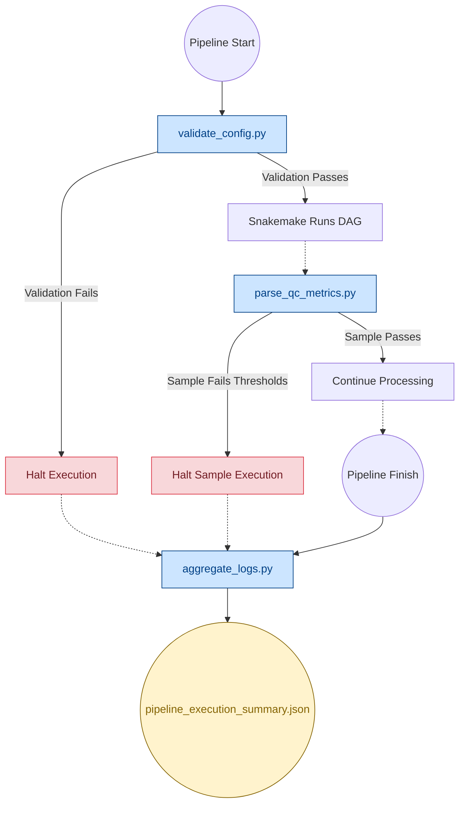
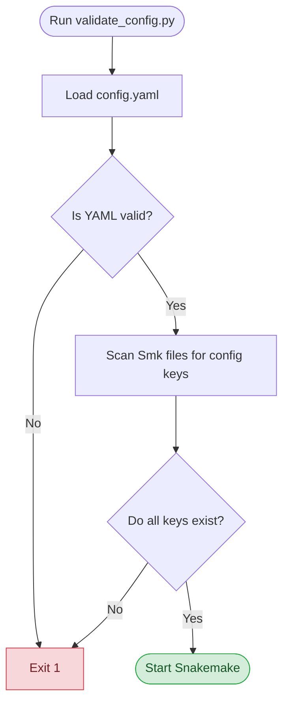
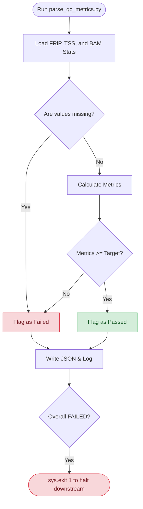
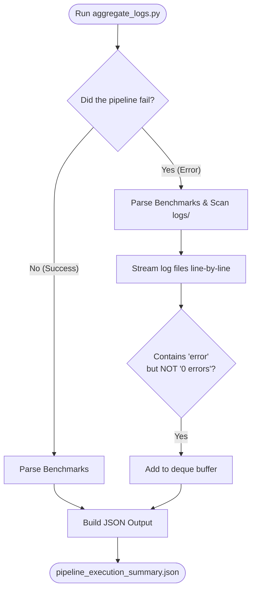

# Pipeline Scripts

This directory contains the core Python utilities that power the CUT&RUN pipeline infrastructure. They ensure configuration safety, enforce quality control (QC), and collect performance telemetry.

---

## 🏗️ Pipeline Integration Architecture



---

## 📁 Individual Script Details
*Click on a script below to expand its specific critical features, code architecture, and logic flowchart.*

<details>
<summary><b><code>► validate_config.py</code></b> (Startup Validation)</summary>

<br>

**When it runs:** Immediately at pipeline startup.

Ensures fail-fast behavior before compute resources are wasted by verifying that the `config.yaml` and environment files are completely robust.

### Critical Features
- **Dynamic Configuration Key Discovery:** Scans all `.smk` rule files using Regular Expressions to dynamically guarantee every requested key actually exists in the config.
  ```python
  for raw_keys in CONFIG_ACCESS_PATTERN.findall(line):
      keys = tuple(CONFIG_KEY_PATTERN.findall(raw_keys))
      if keys:
          paths.add(keys)
  ```
- **Conda Environment Validation:** Verifies that the referenced `.yaml` environment files physically exist on disk before Snakemake attempts to build them.

### Validation Flowchart


</details>

<details>
<summary><b><code>► parse_qc_metrics.py</code></b> (QC Gating)</summary>

<br>

**When it runs:** After alignment and peak calling for each individual sample.

Evaluates sample quality against strict, user-defined thresholds (like FRiP or Target Mapping Rate).

### Critical Features
- **Hard Gating & MultiQC Integration:** Failing samples immediately halt. Output telemetry is written directly to a JSON file for dashboard integration.
- **Early-Exit OOM Protection:** Streams file iterators and breaks early to guarantee zero Out-Of-Memory crashes, even if a user accidentally passes a massive `.bam` file.
- **Cross-Platform & Typed:** Uses `pathlib.Path` objects and `mypy` strict typing to eliminate OS-level path bugs.
  ```python
  def parse_frip(frip_path: Path) -> float | None:
      ...
  ```

### QC Logic Flowchart


</details>

<details>
<summary><b><code>► aggregate_logs.py</code></b> (Telemetry Aggregation)</summary>

<br>

**When it runs:** At the very end of the pipeline (on both success and failure).

Sweeps all generated `benchmarks/` and `logs/` to produce a final, summarized JSON report for humans and AI agents.

### Critical Features
- **Memory Safe Streaming (OOM Protection):** Streams massive log files line-by-line using a rolling `deque` buffer to completely prevent Out-Of-Memory crashes.
  ```python
  error_lines: deque[str] = deque(maxlen=5)
  with open(filepath, "r") as f:
      for line in f:
          if is_actual_error(line):
              error_lines.append(line.strip())
  ```
- **False Positive Filtering:** Intelligently ignores tools that print harmless biology metrics disguised as errors.
  ```python
  false_positives = ["0 error", "no error", "zero error"]
  if any(fp in line_lower for fp in false_positives):
      return False
  ```

### Aggregation Flowchart


</details>
