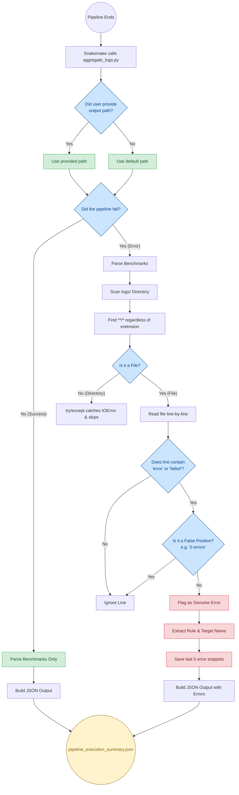
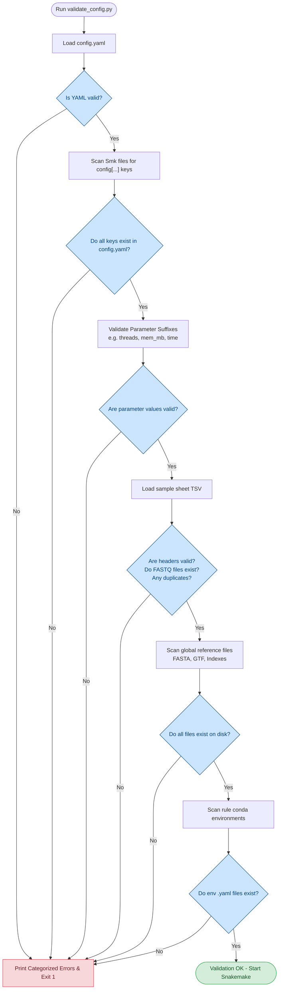

# Pipeline Scripts & Telemetry

This directory contains utility scripts for the CUT&RUN pipeline.

---

## `aggregate_logs.py`

This script is automatically triggered by Snakemake when the pipeline finishes. It sweeps the `benchmarks/` and `logs/` directories to generate a structured JSON report (`pipeline_execution_summary.json`).

### Key Features

**1. Default Path Fallback**
Prevents `IndexError` crashes by falling back to a default JSON output path if the user or Snakemake does not provide one in the terminal.
```python
if len(sys.argv) > 2:
    output_json = sys.argv[2]
else:
    output_json = "results/reporting/pipeline_execution_summary.json"
```

**2. Extension-Agnostic Sweeping**
Uses the `**/*` wildcard with a `try/except` block to safely scan all outputs. It gracefully skips directories and unreadable binary files without relying on strict `.log` or `.err` extensions.
```python
for filepath in sorted(glob.glob(f"{logs_dir}/**/*", recursive=True)):
    try:
        with open(filepath, "r") as f:
            lines = f.readlines()
    except (IOError, UnicodeDecodeError):
        continue
```

**3. False Positive Filtering**
Filters out tools that print harmless biology metrics disguised as errors (e.g., "0 errors").
```python
false_positives = ["0 error", "no error", "zero error"]
if any(fp in line_lower for fp in false_positives):
    return False
```

### Data Flow Architecture



---

## `validate_config.py`

This script is automatically called by Snakemake at startup before building the DAG. It validates that your `config.yaml` and sample sheet contain all required keys, valid parameter ranges, and that all files exist on disk.

### Key Features

**1. Dynamic Configuration Key Discovery**
Instead of hardcoding a list of required keys, it scans the `Snakefile` and all `rules/*.smk` rule files using Regular Expressions to identify exactly what config keys are accessed by the pipeline code.
```python
for raw_keys in CONFIG_ACCESS_PATTERN.findall(line):
    keys = tuple(CONFIG_KEY_PATTERN.findall(raw_keys))
    if keys:
        paths.add(keys)
```

**2. Conda Environment Validation**
Scans all rule files for conda env requirements and verifies that the referenced `.yaml` environment files exist on disk.
```python
resolved_path = (workflow_file.parent / conda_path_str).resolve()
if not resolved_path.exists():
    errors.append(
        f"Conda environment file not found: '{conda_path_str}'"
    )
```

**3. Dynamic Reference Path Checking**
Iterates through the config map to dynamically identify reference genome files (`_fa`, `_bed`, `_gtf`, `_sizes`, `_db`, `blacklist`) and index prefixes (`bowtie_index`, `ecoli_index`), checking their existence on disk.
```python
is_global_ref = (next_prefix[0] == "global" and (
    key.endswith(("_fa", "_bed", "_gtf", "_index", "_sizes", "_db")) or
    key == "blacklist"
))
```

### Validation Flow Architecture


