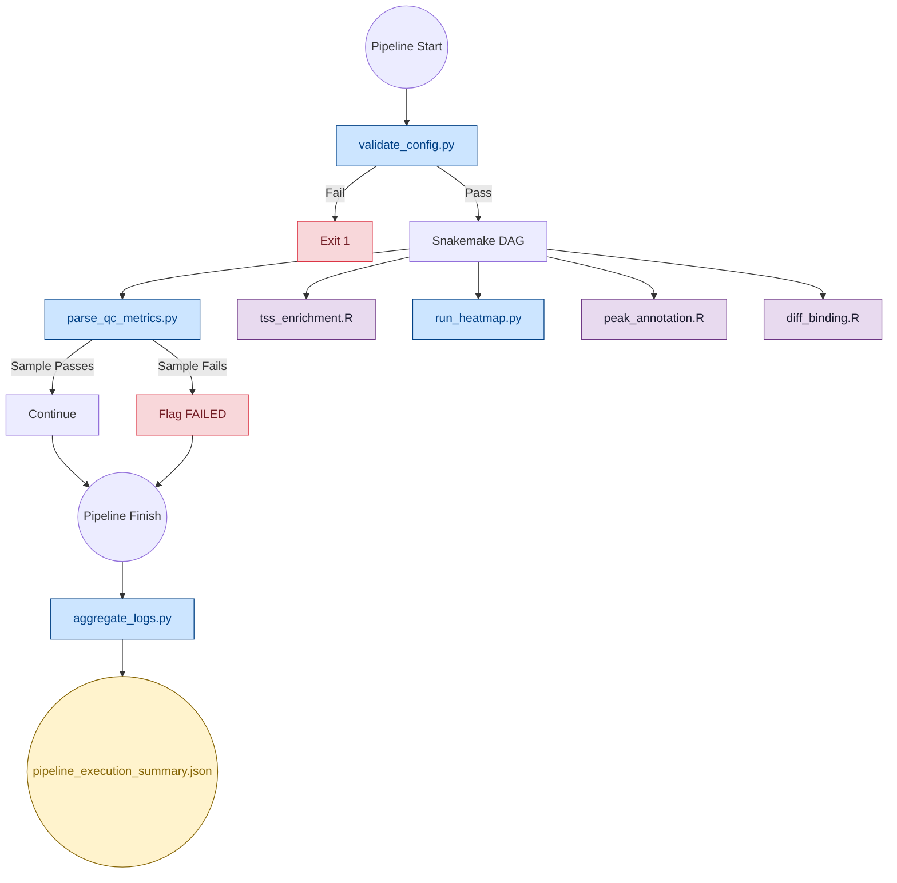
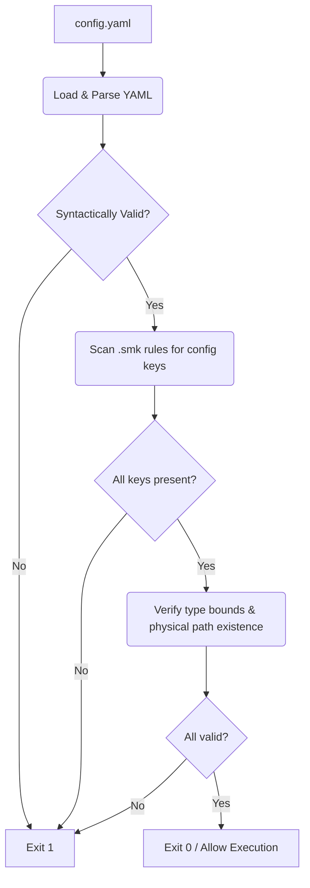
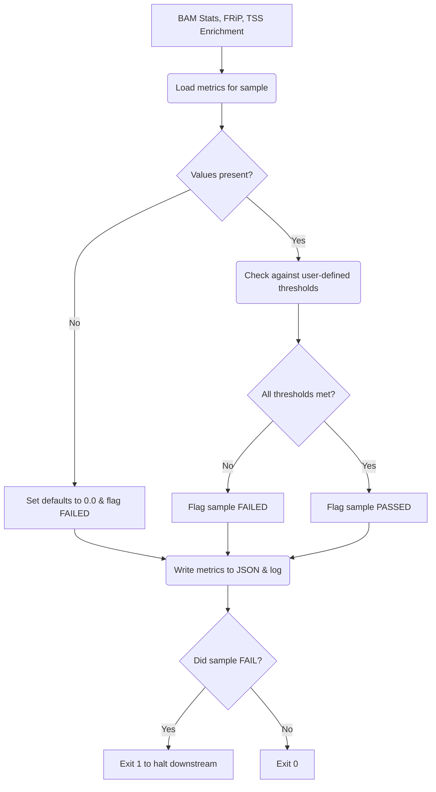
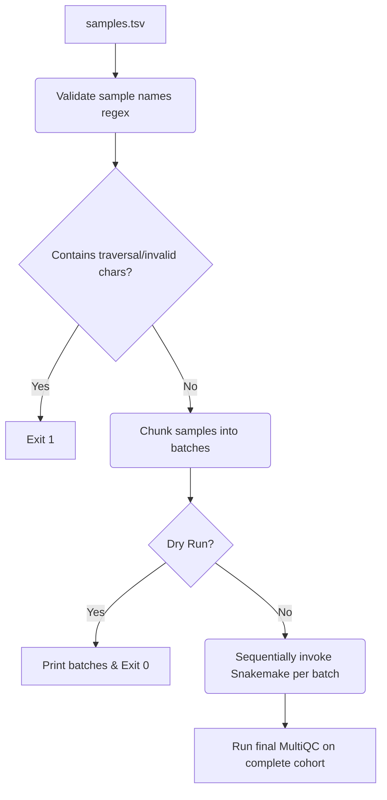
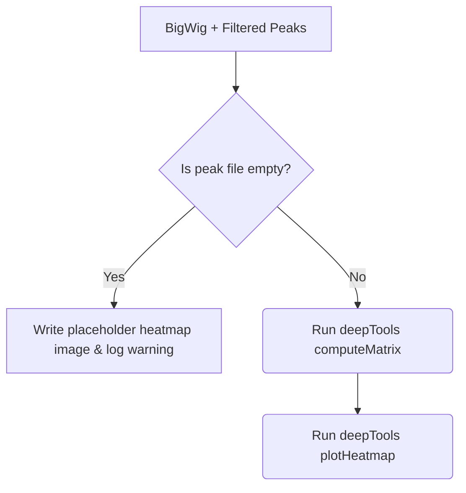
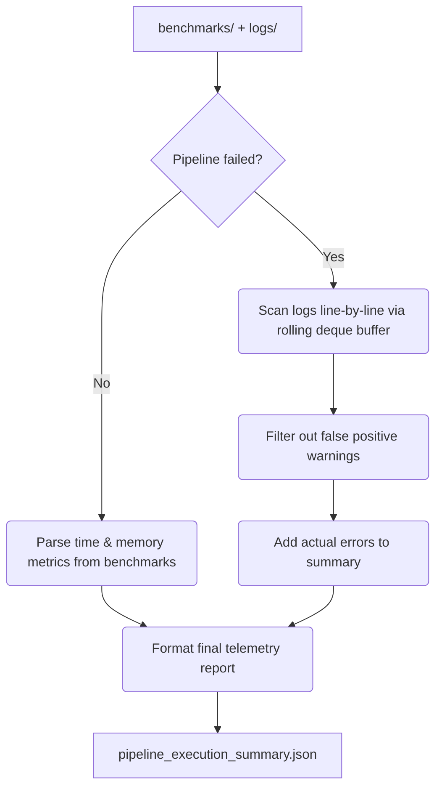
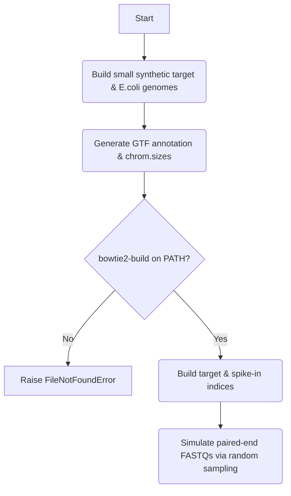
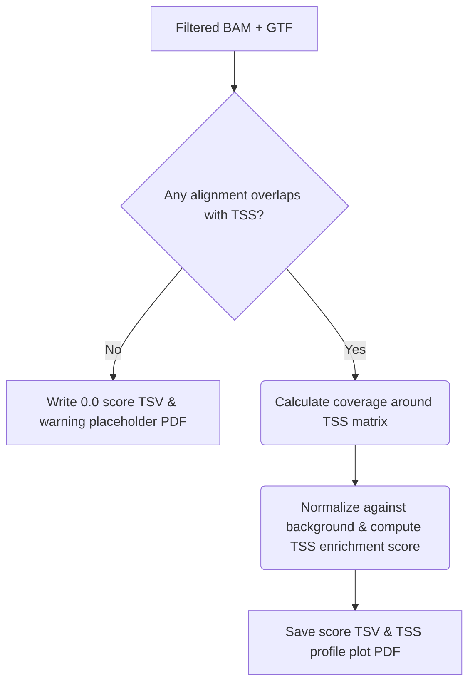
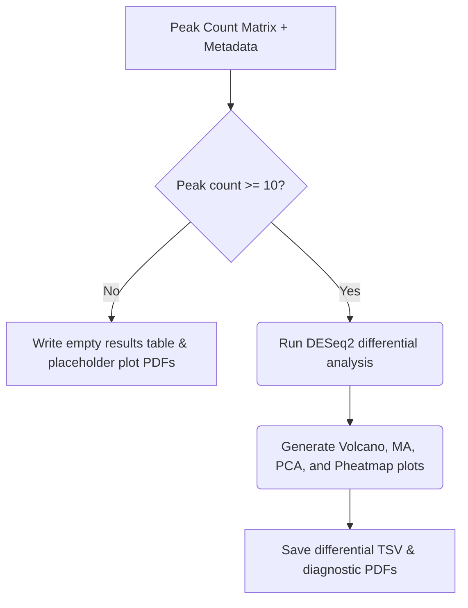
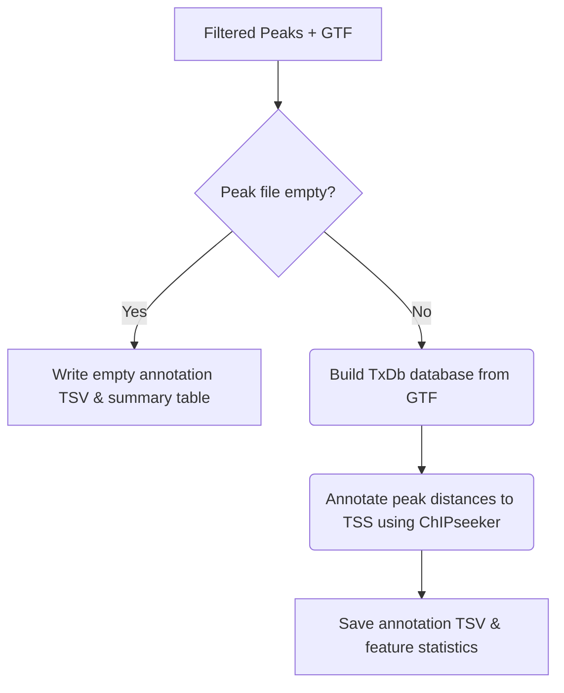

# Pipeline Scripts

Core Python and R utilities that power the CUT&RUN pipeline's validation, quality control, analytics, and telemetry.

---

## 🏗️ Integration Architecture

---

## 📁 Script Reference

### Python Scripts

| Script | When it Runs | Purpose |
|---|---|---|
| `validate_config.py` | Before DAG | Scans `.smk` files for config references, verifies keys exist, checks scalar types, confirms physical files |
| `parse_qc_metrics.py` | After alignment | Evaluates FRiP, TSS enrichment, and mapping rates against thresholds; flags failures |
| `run_batched.py` | Manual invocation | Batches samples for sequential Snakemake execution on low-memory machines |
| `run_heatmap.py` | After BigWig | Wraps deepTools `computeMatrix` + `plotHeatmap`; handles empty peak files gracefully |
| `aggregate_logs.py` | After completion | Streams `benchmarks/` and `logs/` into a single JSON summary; filters false-positive errors |
| `generate_test_data.py` | CI/CD only | Builds synthetic reference genomes, indices, and paired-end FASTQs for automated testing |
| `test_validate_config.py` | CI/CD only | Unit tests for `validate_config.py` |

### R Scripts

| Script | When it Runs | Purpose |
|---|---|---|
| `tss_enrichment.R` | After filtering | Computes per-sample TSS enrichment scores from filtered BAMs; writes fallback outputs on zero overlaps |
| `diff_binding.R` | After peak counting | Runs DESeq2 differential binding with volcano, MA, PCA, and heatmap plots; handles < 10 peaks gracefully |
| `peak_annotation.R` | After blacklist filter | Annotates peaks with ChIPseeker/TxDb; writes empty frames if peak file is zero-size |

---

## 🔒 Fail-Safe Boundaries

Every analytic script implements defensive error handling to prevent a single bad sample from crashing a multi-day cohort run:

| Script | Failure Scenario | Behavior |
|---|---|---|
| `tss_enrichment.R` | Zero TSS overlaps | Writes `0.0` enrichment TSV + warning PDF |
| `diff_binding.R` | < 10 consensus peaks | Writes dummy matrices + placeholder plots |
| `peak_annotation.R` | Empty peak file | Writes empty data frames with correct headers |
| `run_heatmap.py` | Empty filtered peaks | Skips deepTools, writes placeholder image |
| `parse_qc_metrics.py` | Parse failure | Defaults metrics to `0.0`, flags sample as `FAILED` |

---

## 📊 Script Flowcharts

### 1. `validate_config.py` (Startup Validator)

▶ Click to Expand Flowchart

### 2. `parse_qc_metrics.py` (QC Gate)

▶ Click to Expand Flowchart

### 3. `run_batched.py` (Low-Resource Batch Orchestrator)

▶ Click to Expand Flowchart

### 4. `run_heatmap.py` (Heatmap Visualizer)

▶ Click to Expand Flowchart

### 5. `aggregate_logs.py` (Telemetry Aggregater)

▶ Click to Expand Flowchart

### 6. `generate_test_data.py` (CI/CD Synthetic Generator)

▶ Click to Expand Flowchart

### 7. `tss_enrichment.R` (TSS Coverage Engine)

▶ Click to Expand Flowchart

### 8. `diff_binding.R` (DESeq2 Contrast Engine)

▶ Click to Expand Flowchart

### 9. `peak_annotation.R` (ChIPseeker Annotator)

▶ Click to Expand Flowchart

