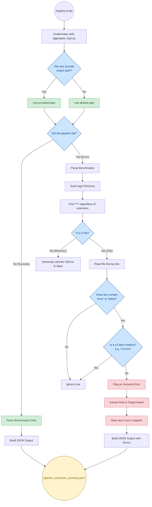

# Pipeline Scripts & Telemetry

This directory contains utility scripts for the CUT&RUN pipeline.

## `aggregate_logs.py`

This script is automatically triggered by Snakemake when the pipeline finishes. It sweeps the `benchmarks/` and `logs/` directories to generate a structured JSON report (`pipeline_execution_summary.json`).

### Key Features

**1. Default Path Fallback**
Prevents `IndexError` crashes by falling back to a default JSON output path if the user or Snakemake does not provide one in the terminal.
```python
if len(sys.argv) > 2:
    output_json = sys.argv[2]
else:
    output_json = "results/reporting/pipeline_execution_summary.json"
```

**2. Extension-Agnostic Sweeping**
Uses the `**/*` wildcard with a `try/except` block to safely scan all outputs. It gracefully skips directories and unreadable binary files without relying on strict `.log` or `.err` extensions.
```python
for filepath in sorted(glob.glob(f"{logs_dir}/**/*", recursive=True)):
    try:
        with open(filepath, "r") as f:
            lines = f.readlines()
    except (IOError, UnicodeDecodeError):
        continue
```

**3. False Positive Filtering**
Filters out tools that print harmless biology metrics disguised as errors (e.g., "0 errors").
```python
false_positives = ["0 error", "no error", "zero error"]
if any(fp in line_lower for fp in false_positives):
    return False
```

### Data Flow Architecture


