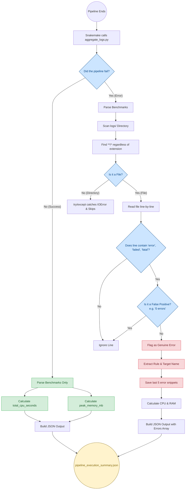

# Pipeline Scripts & Telemetry

This directory contains utility scripts used by the CUT&RUN pipeline to handle execution, observability, and data formatting.

## `aggregate_logs.py`

This script is the core of the pipeline's observability architecture. It is automatically triggered by Snakemake upon pipeline completion (both success and failure). It sweeps the `benchmarks/` and `logs/` directories to generate a single, structured JSON report (`pipeline_execution_summary.json`) that can be easily parsed by AI Agents (like LangChain) or human engineers.

### Key Features
1. **Extension-Agnostic Log Sweeping:** Uses the `**/*` wildcard combined with an EAFP (Easier to Ask for Forgiveness than Permission) `try-except` block to recursively scan all outputs, ignoring directories and binary corruption gracefully.
2. **False Positive Filtering:** Prevents JSON bloat by filtering out tools that print harmless success metrics disguised as errors (e.g., "0 errors found", "error rate: 0").
3. **Automated Resource Calculation:** Parses Snakemake TSV benchmark files to calculate total CPU time and peak memory across the entire run.

### Data Flow Architecture

