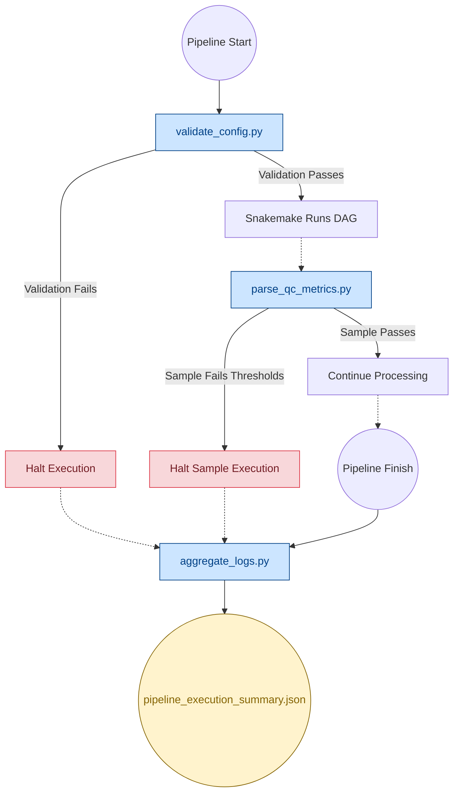

# Pipeline Scripts

This directory contains the core Python utilities that power the CUT&RUN pipeline infrastructure. They ensure configuration safety, enforce quality control (QC), and collect performance telemetry.

---

## 🏗️ Pipeline Integration Architecture

---

## 1. Configuration Validation (`validate_config.py`)
**When it runs:** Immediately at pipeline startup.

Ensures fail-fast behavior before compute resources are wasted. 
- **Dynamic Key Discovery:** Scans all `.smk` rule files to guarantee every requested `config.yaml` key exists.
- **Path Verification:** Checks that sample sheet FASTQs, global reference genomes, and Conda `.yaml` environments physically exist on disk.

## 2. QC Gating (`parse_qc_metrics.py`)
**When it runs:** After alignment and peak calling for each individual sample.

Evaluates sample quality against strict, user-defined thresholds (e.g., FRiP, TSS Enrichment, Mapping Rate, Duplication Rate).
- **Hard Gating:** Failing samples immediately halt to prevent downstream statistical noise.
- **MultiQC Integration:** Outputs clean JSON telemetry that automatically feeds into the final MultiQC dashboard.
- **Strictly Typed:** Fully `mypy`-compliant for rock-solid runtime safety.

## 3. Telemetry Aggregation (`aggregate_logs.py`)
**When it runs:** At the very end of the pipeline (on both success and failure).

Sweeps all generated `benchmarks/` and `logs/` to produce a human- and AI-readable JSON summary.
- **Memory Safe:** Streams massive bioinformatics log files line-by-line using a rolling `deque` buffer to prevent Out-Of-Memory (OOM) crashes in CI/CD runners.
- **Robust Parsing:** Scopes exceptions to individual rows to entirely eliminate the risk of silent data drops.
- **False Positive Filtering:** Intelligently ignores tools that print harmless biology metrics (e.g., "0 errors").
